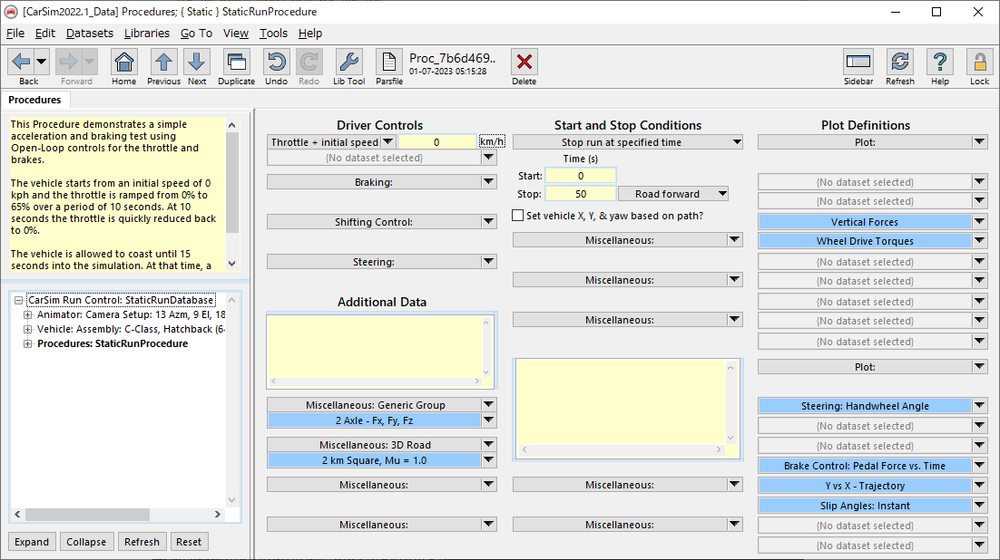
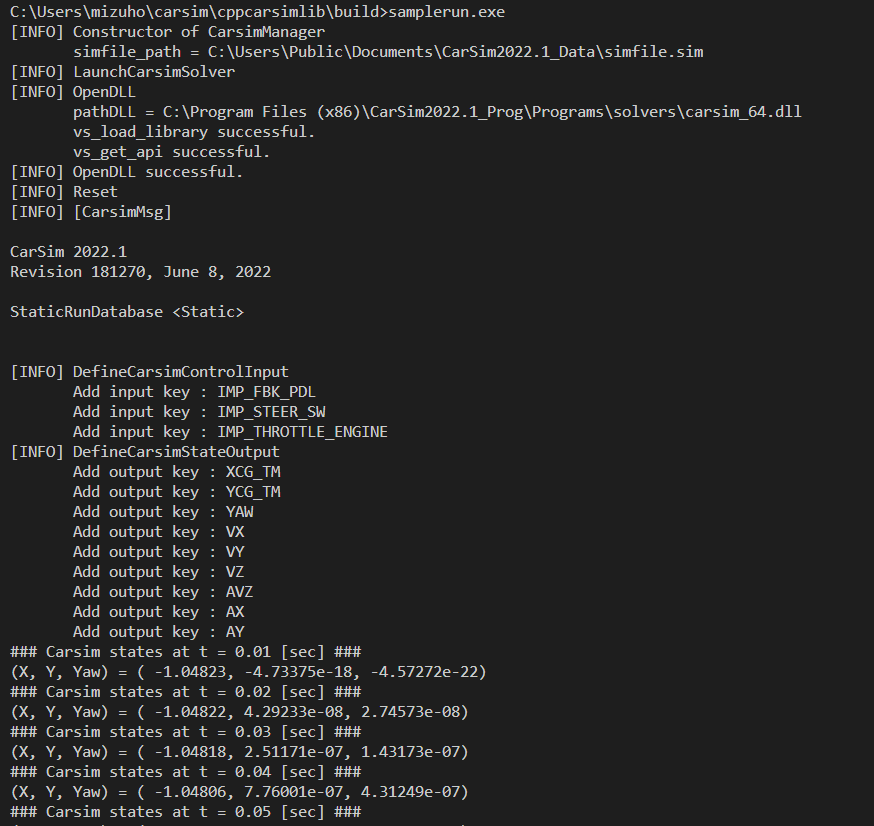
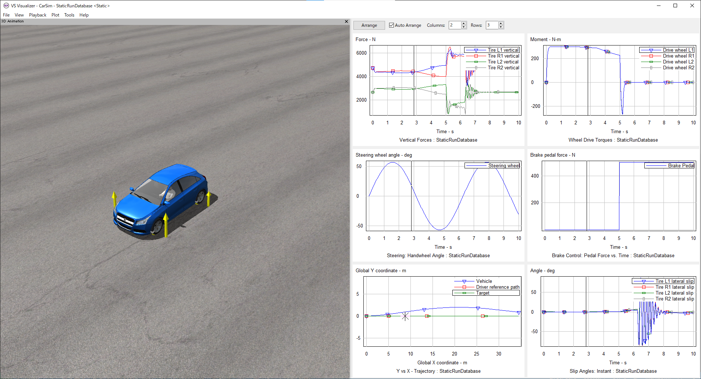

# cppcarsimlib

## Target environment
- Windows 10
- C++17
- Carsim 2022.1

## How to set up environment.
1. Install scoop
    1. `Set-ExecutionPolicy RemoteSigned -Scope CurrentUser`
    1. `irm get.scoop.sh | iex`
1. Install c++ build tools
    - `scoop install mingw cmake`
1. Clone this repository
    - `cd /path/to/your/workspace`
    - `git clone https://github.com/MizuhoAOKI/cppcarsimlib.git`

## How to build and run a sample program.
1. Launch carsim software.
    - Make a dataset in which vehicle does not run.
    
    - After you finish editing gui, Press "Run Math Model" button to generate a simulation setting file (simfile.sim)
1. Change `SIMFILE_PATH` and `CARSIM_DB_PATH` in `example/samplerun.cpp` if necessary.
1. `cd cppcarsimlib/build`
1. `cmake .. -G "MinGW Makefiles"`
1. `make`
1. `samplerun.exe`
    
1. Press "Video + Plot" button on carsim gui to visualize simulation results.
    
